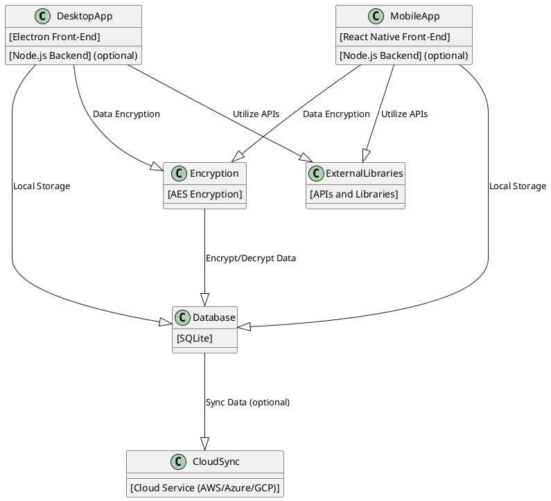

# Password Manager Application Project Initiation Report

## Overview

This project aims to develop a cross-platform password manager application with both desktop and mobile versions. The desktop version will be compatible with Windows, macOS, and Linux, while the mobile version will support iOS and Android.

## Objectives

- **Develop a Secure Password Manager**: Ensure robust security for stored passwords using AES encryption.
- **Cross-Platform Compatibility**: Create applications that are functional and consistent across multiple platforms.
- **User-Friendly Interface**: Design an intuitive and easy-to-use interface for both desktop and mobile versions.
- **Optional Cloud Synchronization**: Implement a feature for syncing data across devices via cloud services.

## Scope

- **Desktop Application**: Develop using Electron for Windows, macOS, and Linux.
- **Mobile Application**: Develop using React Native for iOS and Android.
- **Local Data Storage**: Utilize SQLite for secure local storage of passwords.
- **Encryption**: Implement AES encryption for data security.
- **Cloud Sync (Optional)**: Provide an option for cloud-based synchronization and backup.

## Proposed Technology Stack

- **Desktop Frontend**: Electron
- **Mobile Frontend**: React Native
- **Backend**: Node.js (if required)
- **Database**: SQLite
- **Encryption**: AES
- **Cloud Services (Optional)**: AWS, Azure, or GCP

## Conceptual Architecture

The following PLANTUML diagram illustrates the conceptual architecture of the password manager application:

